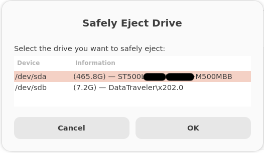
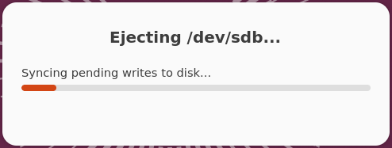
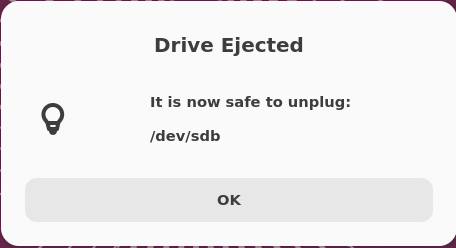
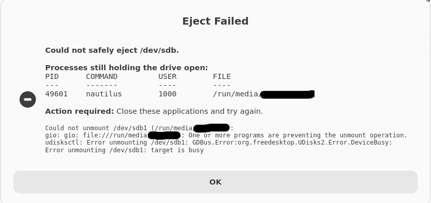

# Safe Eject Linux

A simple GUI utility for Ubuntu and Linux that safely unmounts and powers off external HDDs, SSDs, USB drives, and backup disks before unplugging them.

Unlike many file managers, this tool performs additional safety checks, flushes pending writes, powers off the device, and helps identify processes that are preventing safe removal.

---

## Features

* Graphical drive selector (Zenity)
* Automatically excludes system disks
* Flushes pending disk writes using `sync`
* Unmounts all mounted partitions
* Powers off the selected drive using `udisksctl`
* Prevents accidental ejection of active system drives
* Displays processes and files blocking ejection
* Beginner-friendly Linux GUI utility
* Includes desktop launcher support

---

## Why Use This?

Removing a drive immediately after closing a file manager window can still cause:

* Data corruption
* Incomplete file transfers
* Filesystem errors
* Lost writes due to caching

Safe Eject Linux provides a safer workflow:

1. Detect the target drive
2. Flush pending writes
3. Unmount partitions
4. Power off the device
5. Report any applications preventing removal

When the success dialog appears, it is safe to unplug the drive.

---

## Requirements

Ubuntu / Debian:

```bash
sudo apt install zenity udisks2 lsof
```

---

## Installation

Clone the repository:

```bash
git clone https://github.com/YOUR_USERNAME/safe-eject-linux.git

cd safe-eject-linux
```

Make the script executable:

```bash
chmod +x safe-eject.sh
```

Run:

```bash
./safe-eject.sh
```

---

## Desktop Launcher Installation

The repository includes:

```text
eject-external-drive.desktop
```

To install it for your user:

```bash
mkdir -p ~/.local/share/applications

cp eject-external-drive.desktop ~/.local/share/applications/
```

Ensure the script location matches the `Exec=` path in the launcher.

You can then launch **Safe Eject Linux** directly from the application menu.

---

## Project Structure

```text
safe-eject-linux/
│
├── safe-eject.sh
├── eject-external-drive.desktop
├── LICENSE
├── README.md
└── screenshots/
```

---

## How It Works

### Drive Detection

The script automatically excludes drives containing active Linux system partitions such as:

* /
* /boot
* /boot/efi
* /usr
* /var
* /home

This helps prevent accidental system damage.

### Safe Write Flush

Before unmounting:

```bash
sync
```

is executed to ensure pending writes reach the physical device.

### Partition Unmounting

All mounted partitions on the selected drive are safely detached.

### Device Power-Off

The script uses:

```bash
udisksctl power-off
```

to place the drive into a safe removable state.

### Diagnostic Reporting

If ejection fails, the script attempts to identify:

* Open files
* Running applications
* Active processes
* File locks

and displays them in an easy-to-read format.

---

## Screenshots

### Drive Selection



### Ejection Progress



### Successful Ejection



### Diagnostic Error Report



---

## Tested On

* Ubuntu 22.04 LTS
* Ubuntu 24.04 LTS

Contributions for additional Linux distributions are welcome.

---

## Security

This utility intentionally refuses to eject drives that appear to contain active system partitions.

Always verify the selected drive before unplugging hardware.

---

## License

MIT License

---

## Contributing

Bug reports, pull requests, and feature suggestions are welcome.

If the tool helped you, consider starring the repository.

---

## Keywords

Ubuntu safe eject

Linux safely remove hardware

External HDD unmount Linux

USB drive eject Ubuntu

Power off USB disk Linux

Zenity storage utility

Linux external drive management

Safe HDD removal tool

Safe SSD eject utility

UDisks2 graphical eject tool
